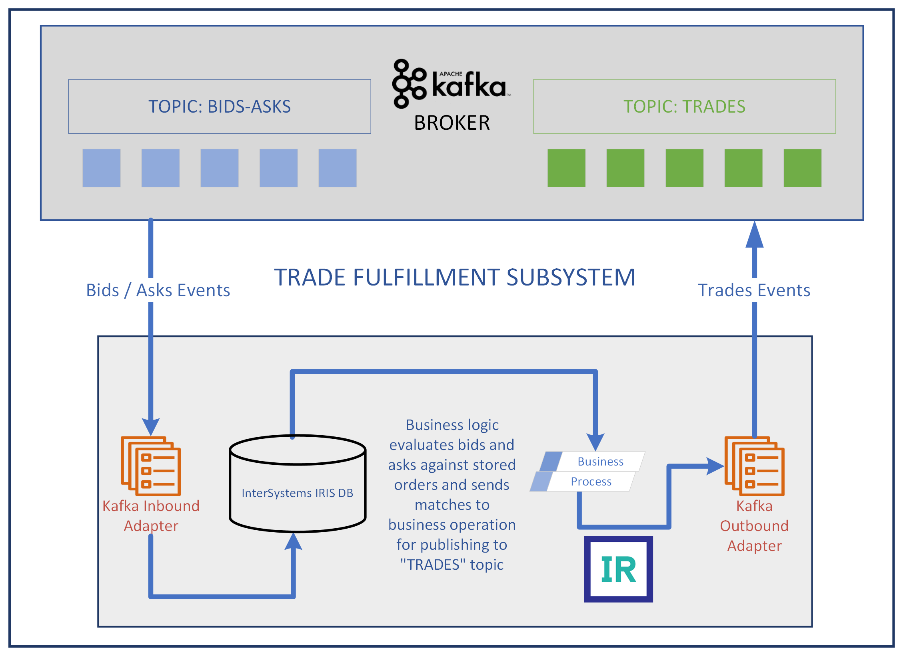

# iris-kafka-docker
Demonstrate InterSystems IRIS and Kafka integration. In this solution, Kafka is installed in the IRIS container. If you're looking for a solution where IRIS is running natively with a containerised implementation of Kafka, plesae [see here](https://github.com/isc-krakshith/iris-native-kafka-docker) OR for a solution running IRIS and Kafka in separate containers, [see here](https://github.com/isc-krakshith/iris-docker-kafka-docker)

## Prerequisites
Make sure you have [git](https://git-scm.com/book/en/v2/Getting-Started-Installing-Git) and [Docker desktop](https://www.docker.com/products/docker-desktop) installed.

## Installation 

Clone/git pull the repo into any local directory

```
$ git clone https://github.com/isc-krakshith/iris-kafka-docker.git
```

Open the terminal in this directory and run:

```
$ docker-compose build
```
Among other things, iris.script which is called by the installer at this stage populates the Orders table with synthetic data.

3. Run the IRIS container with your project:

```
$ docker-compose up -d
```
## Solution


## How to Use it
### Start the InterSystems IRIS Production
Open [InterSystems IRIS Management Portal](http://localhost:52773/csp/sys/UtilHome.csp) on your browser

default account _SYSTEM / SYS will need to be changed at first login

Start the [Kafka.TraderProduction](http://localhost:52773/csp/kafka/EnsPortal.ProductionConfig.zen?PRODUCTION=Kafka.TraderProduction), by clicking the "Start" button
### Start Kafka. Tnen produce and consume events via shell sessions inside the container
#### EXECUTE 4x CONTAINER SHELLS
++++++++++++++++++++++++++
```
docker-compose exec iris bash
```
CD TO KAFKA INSTALLATION
```
cd /kafka/kafka_2.13-3.0.1/
```
#### START THE KAFKA ENVIRONMENT
##### BASH 1 : START ZOOKEEPER
In the frist shell...
```
bin/zookeeper-server-start.sh config/zookeeper.properties
```
##### BASH 2 : START BROKER
In the second shell...
```
bin/kafka-server-start.sh config/server.properties
```
##### BASH 3 : CREATE A TOPIC
In the third shell...
```
bin/kafka-topics.sh --create --topic bids-Asks --bootstrap-server localhost:9092
```
###### DESCRIBE TOPIC
```
bin/kafka-topics.sh --describe --topic bids-Asks --bootstrap-server localhost:9092
```
###### PRODUCE EVENTS ON TOPIC
```
bin/kafka-console-producer.sh --topic bids-Asks --bootstrap-server localhost:9092
```
##### BASH 4 : CONSUME EVENTS FROM A TOPIC
In the fourth shell...
```
bin/kafka-console-consumer.sh --topic trades --bootstrap-server localhost:9092
```
##### BASH 3 : PRODUCE EVENTS
Go back to the third shell...
Then generate bid-ask events, one line at a time... After each event is produced, the resulting trades topic events are visbile the fourth shell described above as well as in the Management Portal (Select any of the components of the production by clicking once -> On the right hand pane, select the "Messages" tab, then any of the messages in the list to explore them in depth)
```
{"dateTime":"2022-06-07T13:16:22.000","ref":"OH77BBN3", "security":"SECA", "bid":50, "ask":0, "vol":300}
```
```
{"dateTime":"2022-06-07T13:17:32.000","ref":"OH77CBN3", "security":"SECB", "bid":0, "ask":50, "vol":400}
```
```
{"dateTime":"2022-06-07T13:18:42.000","ref":"OH77DBN3", "security":"SECC", "bid":0, "ask":55, "vol":200}
```
```
{"dateTime":"2022-06-07T13:19:52.000","ref":"OH77EBN3", "security":"SECD", "bid":70, "ask":0, "vol":250}
```
## What's inside the repository

### Dockerfile

Dockerfile which starts IRIS and imports Installer.cls and then runs the Installer.setup method, which creates KAFKA Namespace and imports ObjectScript code from /src and /testdata folders into it.

### .vscode/settings.json

Settings file to let you code in VSCode with [VSCode ObjectScript plugin](https://intersystems-community.github.io/vscode-objectscript/)

### .vscode/launch.json
Config file if you want to debug with VSCode ObjectScript

### Apache Kafka v 2.13-3.0.1
Docker host volume bind makes this available within the container at /kafka/kafka_2.13-3.0.1

### Kafka.TraderProduction.cls
Contains the InterSystems IRIS Production settings, which brings up  EnsLib.Kafka.Service and EnsLib.Kafka.Operation and specifies the Kafka broker and topic parameters. It also contains the prameters used by the business process.

### Kafka.TraderProcess.cls
All the business logic is here

### Kafka.TestKafkaMessagingClient.cls
Creates a Kafka client using native API calls and runs tests on it to verify succesful functioning.
#### Start InterSystem IRIS terminal in running container to test it
```
docker-compose exec iris iris session iris

zn "KAFKA"

do ##class(Kafka.TestKafkaMessagingClient).KafkaClient()
```
